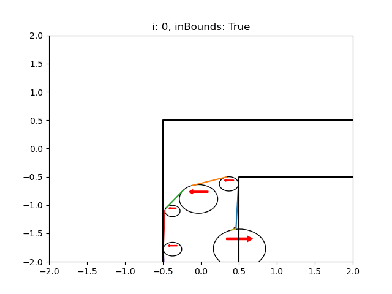

# The Problem

Ponder the following. 
You are moving out from your parents house. 
You also happen to be a two dimensional creature living in a parallell universe, and you want a sofa.
A big one.
To get the sofa into your new appartment you need to carry it down a corridor of width 1 with a sharp 90˚ corner.
What is the maximum area of the sofa that you could carry around the corner?

# The Program 

This program attempts to solve that problem by optimizing the shape of the sofa using a genetic algorithm

# Status

Am currently redisigning the evolution algorithm, the previous one was too slow (and quite messy to be honest), but it did accomplish this marvelous sofa:

------------------------------------------------------------------------------
notes:

Run tests while in root directory with `python3 -m Tests.ShapeTests`
